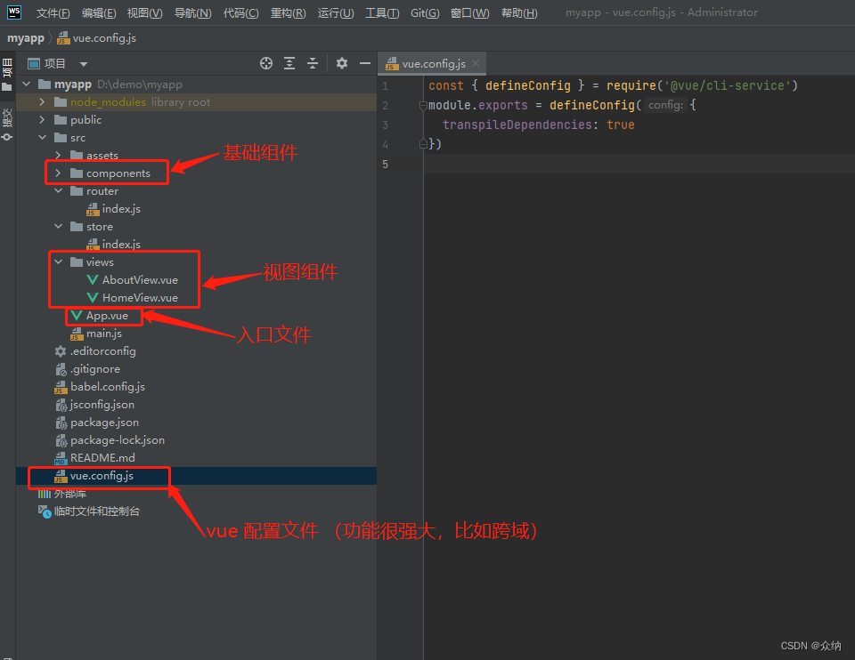
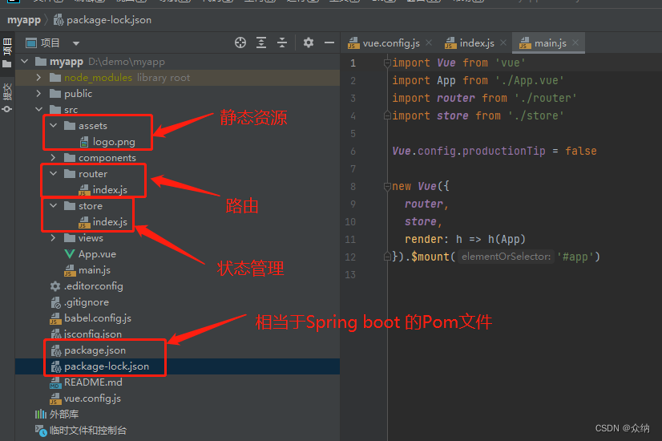

# redis-client

## Project setup
```
npm install
```

### Compiles and hot-reloads for development
```
npm run serve
```

### Compiles and minifies for production
```
npm run build
使用这个命令后会生成dist文件夹，包含静态文件，因此如果前端是独立部署，则以静态资源部署即可。
这对于不同的服务部署要求不同，比如阿里SAE环境支持成nodejs环境，没有vue相关的依赖，因此需要打包成静态资源。
对于vercel服务，可以直接以源代码方式提交，因为它本身支持vue.js.
```

### Lints and fixes files
```
npm run lint
```

### Customize configuration
See [Configuration Reference](https://cli.vuejs.org/config/).

### 项目结构

